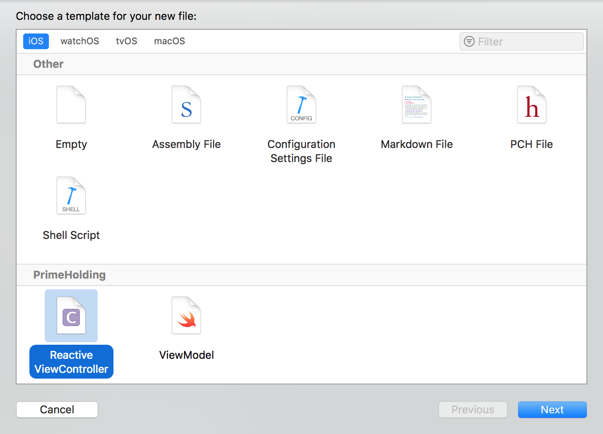
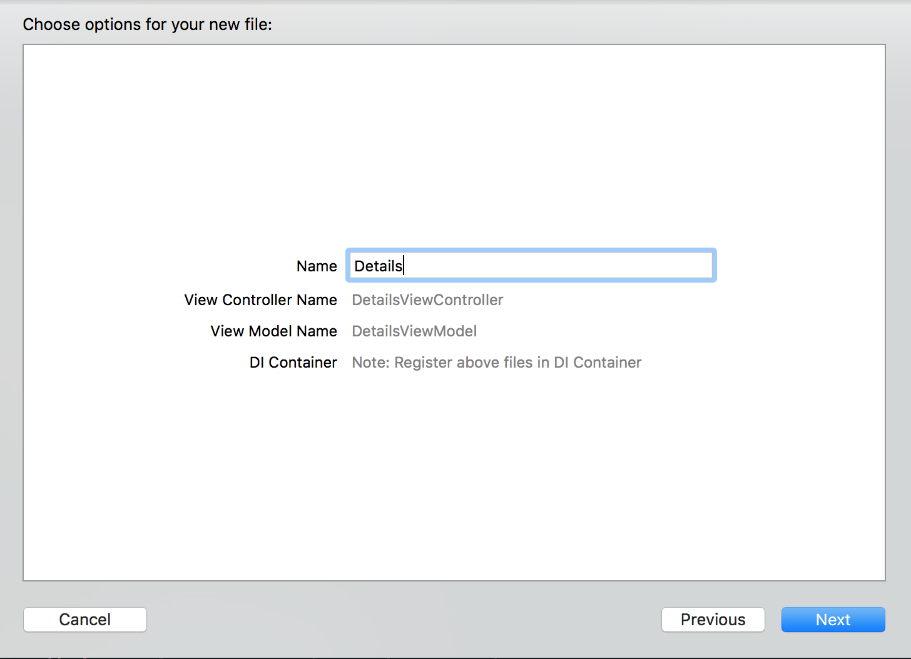
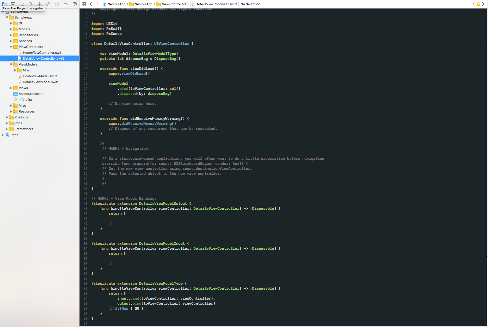
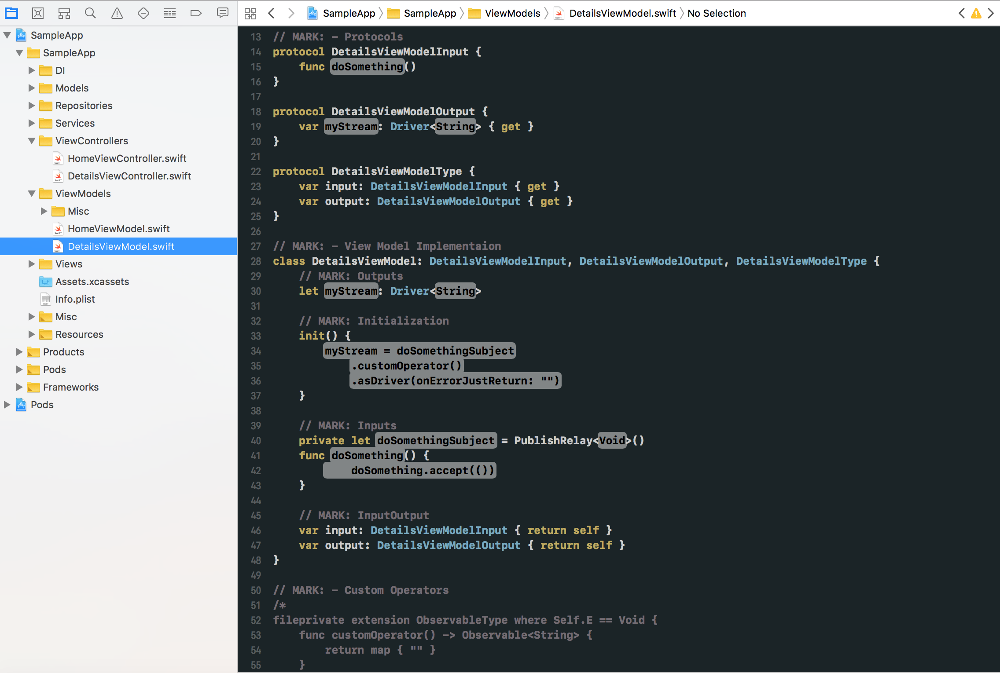
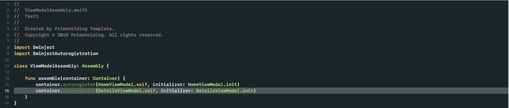
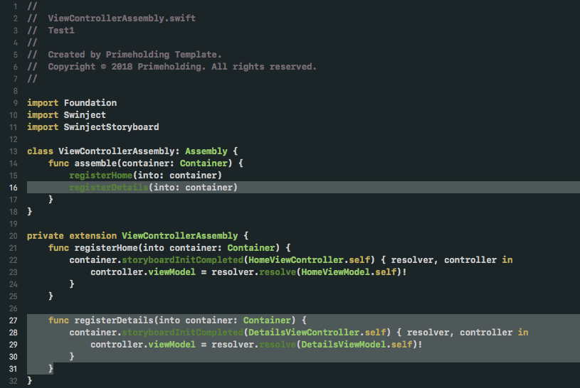

# Description
With Prime Holding's templates you can create screens with easy.

# Create new screen (ViewController and ViewModel)

* Once you have your project up and running you will be able to create new screens with easy.

The template Reactive ViewController faciliates screens creation as:
* Creates a ViewController template

* Creates a ViewModel template that is associated with the above ViewController

* You should **manually** add the files into DI
 1. Add the ViewModel you have created in ViewModelAssembly so DI can resolve it when needed
 
 2. Add the ViewController you have created in ViewControllerAssembly so DI can resolve it when needed
 
